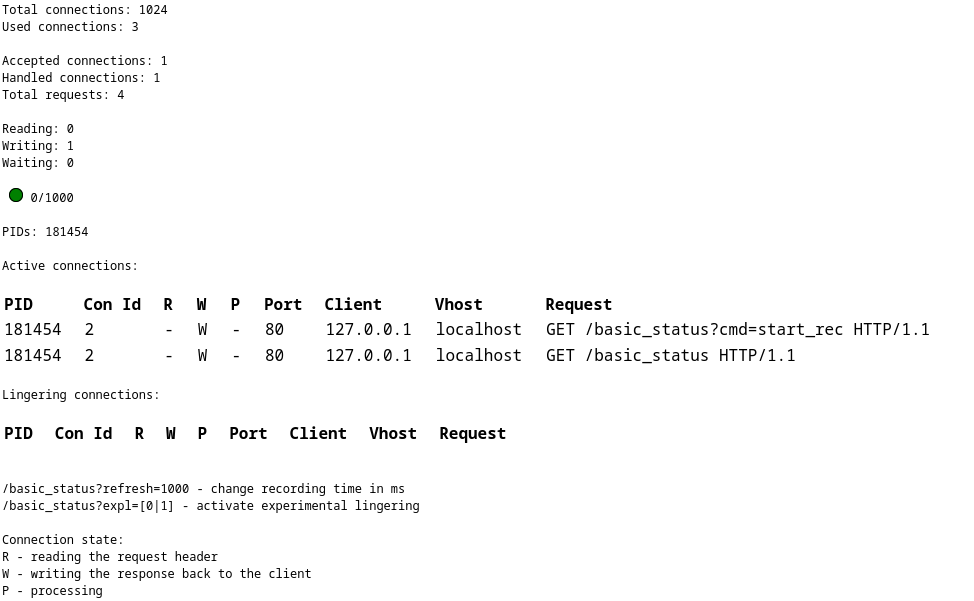

nginx mod status module

- this plugin is the alternative to the apache mod_status module for nginx

- it provides the information about the connections on the server taken from the log phase which is later written to the log files 
by nginx; it displays the info in a table similar to the one provided by apache in their plugin; there's also an epoll plugin for 
linux provided which catches the lingering conections that don't get closed by nginx.



- compile:

	- cd to nginx source dir, run:

```
	export CFLAGS="-Wno-error=unused -O2"
	./configure --with-compat --add-dynamic-module='/path/to/ngx_mod_status' --add-dynamic-module='/path/to/ngx_mds_epoll' \
		--with-http_stub_status_module --with-threads

	make
```

	- add --with-debug for debugging

- module is found in objs dir, the files are ngx_mds_epoll.so and ngx_mod_status.so, include both files, in the nginx configuration
	
	i.e: nginx.conf

```
	load_module /path/to/ngx_mds_epoll.so;
	load_module /path/to/ngx_mod_status.so;
```

- edit nginx.conf to load module:

```
	events {
		use mds_epoll;
	}

	location = /basic_status {
		ngx_mds;
		ngx_mds_msg_size 500; # >= 500, maximum number of characters on one line in results
		ngx_mds_msg_count 20; # >= 5, maximum number of lines per process in results
	}

	location / {
		# path to .js file or link to .js file
		root /path/to/js_file;
		index  index.html index.htm;
	}
```

- ngx_mds_epoll.so is optional, if used enable it in the events configuration as shown bellow:

```
	events {
		use mds_epoll;
	}
```

- edit js file and change script_name variable if location = /basic_status is changed

- tuning:

	- adjust refresh variable in js file higher or lower than 500, then adjust browser refresh variable, it should be double the size
		of the js variable, thus arround 1000
		
		i.e:

```
	browser: /basic_status?refresh=1000
	ngx_mod_status.js: var refresh = 500;
```

	- activate experimental lingering scan by using expl variable in browser
	
		i.e:

```
	browser turn on expl: /basic_status?expl=1
	browser turn off expl: /basic_status?expl=0
```

	- combine tuning variables
	
		i.e:

```
	browser: /basic_status?refresh=1000&expl=0
```

- tested with nginx 1.16.0, 1.20.0, 1.29.4

- for issues with the compilation of the plugin or running it don't hesitate to contact me at cobyce@yahoo.com

- if you need help in setting up the plugin for a commercial application contact me at the aforementioned
e-mail address for commercial assist

- the plugin is released under the AGPL license for commercial and non commercial use


